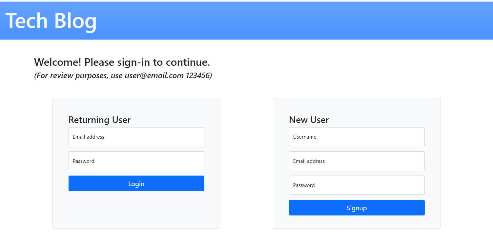

# Model-View-Controller (MVC): Tech Blog

  

## Description

This app is a CMS-style blog site similar to a Wordpress site, where developers can publish their blog posts and comment on other developers' posts as well.  It was built completely from scratch and is depoloyed on Heroku.  The app follows the MVC paradigm in its architectural structure, using Handlebars.js as the templating language, Sequelize as the ORM, and the express-session npm package for authentication.
  

## Table of Contents

- [Installation](#installation)
- [Usage](#usage)
- [License](#license)
- [Collaborators](#collaborators)
- [Questions](#questions)
  

## Installation

This repository can be cloned by using the following command:
~~~
gh repo clone rmoatman/Tech_Blog
~~~

Then, install the MySql2, Sequelize, express-handlebars, dotENV, bcrypt, express-session, connect-session-sequelize, and Express packages using the command:
~~~
npm install
~~~
 

## Usage

To run the app, use the command:
~~~
node server.js
~~~
 
## License

This work is covered under MIT License.  For more information, click on the license badge above.
  

## Collaborators

Please contact me using the information below for questions, comments, and suggestions.
  

## Questions

Have a question or comment?  Please contact me at: 
Raemarie Oatman 
GitHub Profile: github.com/rmoatman 
raemarie.oatman@gmail.com # MVC_Tech_Blog
